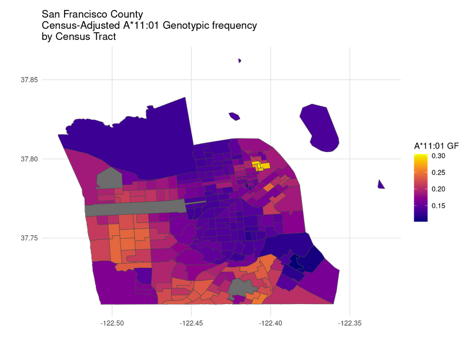

<!-- README.md is generated from README.Rmd. Please edit that file -->

# CensusHLA

[](https://doi.org/10.5281/zenodo.15148807)

[See Github pages (pkgdown)
Documentation](https://affini-t-tx.github.io/CensusHLA/)

CensusHLA is an R package designed to facilitate the analysis of HLA
allele frequencies across the United States using census data and other
external datasets. The package provides tools for importing, processing,
and visualizing HLA frequency data, as well as integrating it with
spatial and demographic information. It is particularly useful for
researchers working in population genetics, immunogenetics, and public
health.

<figure>

<figcaption aria-hidden="true">A11 by County</figcaption>
</figure>

## Features

- Import and process HLA frequency data from external sources,
  specifically Gragert et al. (2013) as hosted by the NMDP.
- Import and process spatial data from the US Census Bureau, including
  shapefiles and demographic data.
- Calculate HLA allele frequencies at various geographic levels (e.g.,
  state, county, catchment).
- Generate visualizations of HLA allele distributions across geographic
  regions.
- Integrate HLA data with US Census spatial and demographic data.

## Installation

To begin using the package, either make sure you have the system
requirements, or install within the provided Docker container. After
setting up the system requirements, clone the source code from github
and begin to add the necessary source data as described below.

## System Requirements

The package was tested using the \[rocker/verse:latest\] Docker
container with R 4.4.3, along with some additional system-level
dependencies. Functions that plot frequencies using US maps and
shapefiles may require the following R packages: `sf`, `h3jsr`,
`rnaturalearth`, and `usmap`.

## Getting Started

### Docker Image

To simplify setup, a pre-configured `Dockerfile` is provided in
`inst/extdata/`. Build the Docker container with:

``` bash
sudo docker build -t custom-rocker-verse .
```

After building, you can start a Posit Workbench server using the
`docker-compose.yml` file in the same directory:

``` bash
docker-compose up
```

Access the server at `http://localhost:8787` with username `rstudio` and
password `password`.

### Census API Key

To access US Census data, you need an API key. Follow the instructions
[here](https://www.hrecht.com/censusapi/articles/getting-started.html#api-key-setup)
to obtain your key. Add the key to your `~/.Renviron` file:

``` r
CENSUS_KEY=<YOUR CENSUS API CODE HERE>
```

### Gragert 2013 Frequency Data

1.  Download HLA-A, HLA-B, and HLA-C frequency data from [this
    site](https://frequency.nmdp.org/).
2.  Place the downloaded `.xlsx` files in the `inst/extdata/` directory.

### Option 1: Automated Setup

To automate the setup process, use the
`inst/scripts/initiate_package_with_external_data.R` script. This script
checks for required files and runs all necessary scripts in the correct
order:

``` r
source("inst/scripts/initiate_package_with_external_data.R")
```

## Option 2: Step-wise Data Preparation

If the automated setup script above does not work, you can manually
prepare the data files.

1.  **Catchment Spatial Files**: Run
    `data-raw/import_delNero2024_catchment.R`. 2 **Census Spatial
    Files**: Run `data-raw/import_census2020_tiger_shapefiles.R`. Note
    that downloading large shapefiles may take time (~30 minutes).
2.  **Import Gragert 2013 Files**: Run
    `data-raw/import_gragert2013_data.R`.
3.  `data-raw/nmdp_racegroups.R`: Creates a data object of NMDP race
    groups.
4.  `data-raw/valid_state_names.R`: Generates a vector of valid state
    names.
5.  `data-raw/us_pop_multirace_in_nmdp_codes.R`: Retrieves US-wide
    population estimates.
6.  `data-raw/nmdp_hla_frequencies_us_2020_census_adjusted.R`: Generates
    US-wide HLA frequency estimates.
7.  `data-raw/census_adjusted_nmdp_hla_frequencies_by_state.R`: Prepares
    state-level HLA frequency data.
8.  `data-raw/census_adjusted_nmdp_hla_frequencies_by_county.R`:
    Prepares county-level HLA frequency data. By default, only the top
    20 most abundant HLAs are included.
9.  `data-raw/add_catchment_calculations_and_data.R`: Adds
    catchment-level calculations.
    1.  This script may take significant time to run.

## Examples

Provide examples of how to use the package for common tasks, such as
visualizing HLA allele distributions or integrating external datasets.

``` r
library(CensusHLA)
state_frequencies <- CensusHLA::census_adjusted_nmdp_hla_frequencies_by_state |> dplyr::filter(allele == 'A*11:01')

out_data <- state_frequencies |>
  dplyr::ungroup() |>
  dplyr::group_by(region, census_region, fips) |>
  dplyr::summarize(gf = sum(us_2020_nmdp_gf))

gg_state <- usmap::plot_usmap(
  data = out_data,
  regions = "states",
  #exclude = c('Alaksa','Hawaii'),
  exclude = c('AK', 'HI'),
  values = "gf",
  color = "black",
  linewidth = 0.1
) +
  viridis::scale_fill_viridis(option = "plasma", direction = 1)

gg_state
```

## Contributing

Contributions are welcome! Please submit issues or pull requests via
GitHub.

## License

This project is licensed under the AGPLv2 License. See the `LICENSE.md`
file for details.

## Acknowledgments

- Gragert et al. (2013) for HLA frequency data.
- US Census Bureau for spatial and demographic data.
